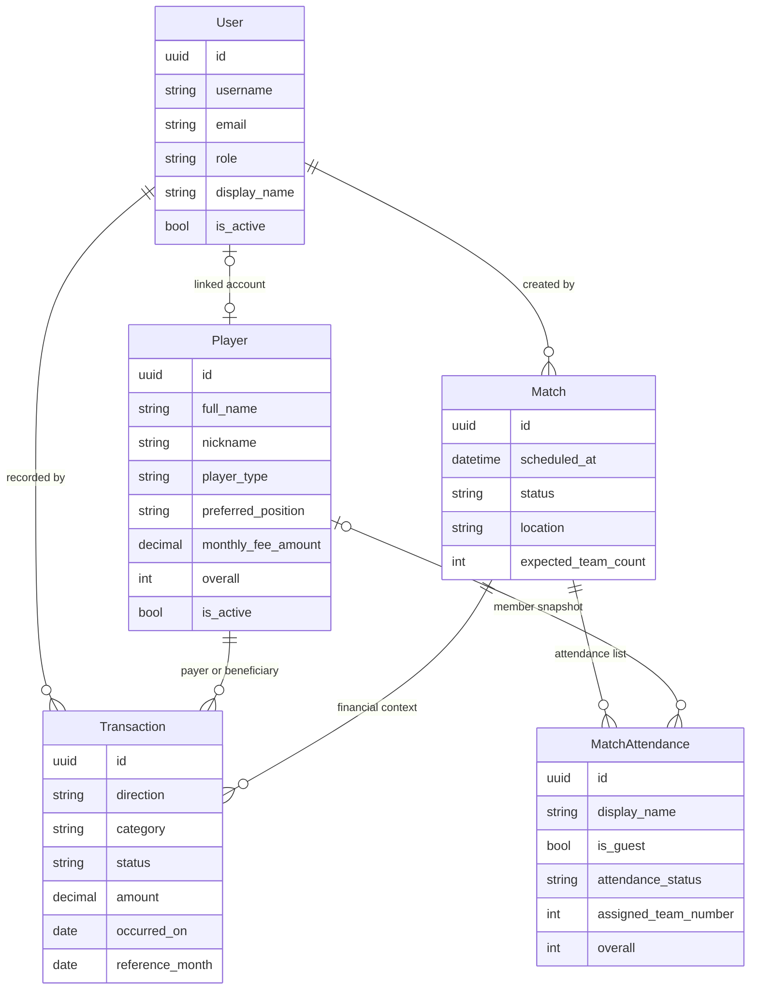

# Peladinhas Sofredores - Blueprint da Fase 1

## Objetivo

Estruturar a base de dados, os contratos de domínio e as interfaces principais da aplicação web "Peladinhas Sofredores" para permitir execução paralela dos agentes de backend, frontend e algoritmo.

## Contextos de domínio

- `users`: autenticação, autorização e vínculo opcional entre conta e mensalista.
- `players`: cadastro dos mensalistas, overall e posição de jogo.
- `finance`: livro-caixa único para entradas e saídas.
- `matches`: agenda semanal, lista de presença e convidados avulsos.
- `teams`: contrato do gerador de times equilibrados.

## Modelo relacional proposto

## Decisões arquiteturais

- O `User` usa RBAC simples com `ADMIN` e `COMMON`, suficiente para a primeira entrega.
- O `Player` concentra overall, posição de jogo e os metadados de mensalista; convidados são persistidos pela presença da partida e não precisam virar mensalistas.
- O `Transaction` é um livro-caixa unificado. O saldo do dashboard é derivado da soma de entradas menos saídas com status `POSTED`.
- O `MatchAttendance` guarda um snapshot do overall usado no sorteio dos times. Isso evita distorção histórica quando o overall de um jogador for alterado depois da partida.
- O `overall` é mantido manualmente.

## Contratos principais

### Backend

- `AuthService`: autenticação, leitura de sessão e verificação de permissões.
- `PlayerService`: CRUD dos mensalistas e atualização de overall/posição.
- `FinanceService`: registro de entradas/saídas, leitura do saldo e extrato.
- `MatchService`: criação da pelada da semana, gestão da presença e convidados.
- `TeamGenerationService`: recebe os presentes, aplica o algoritmo e devolve os times balanceados.

### Frontend

- `AppShell`: layout mobile-first, navegação e controle de sessão.
- `LoginPage`: autenticação do usuário.
- `FinanceDashboardPage`: saldo atual, resumo do caixa e últimas movimentações.
- `RosterManagementPage`: tabela/formulário para editar mensalistas, overall e posição.
- `PreMatchPage`: confirmação de presença, convidados e geração de times.

## Sequência recomendada para a Fase 1

1. Backend cria o projeto Django, o `AUTH_USER_MODEL` customizado e as migrations iniciais.
2. Frontend sobe o scaffold React com tokens de design em tons de cinza e roxo.
3. Algoritmo implementa o serviço de balanceamento usando o contrato em `backend/apps/teams/contracts.py`.
4. Integração conecta os DTOs e endpoints reais aos contratos já definidos.
